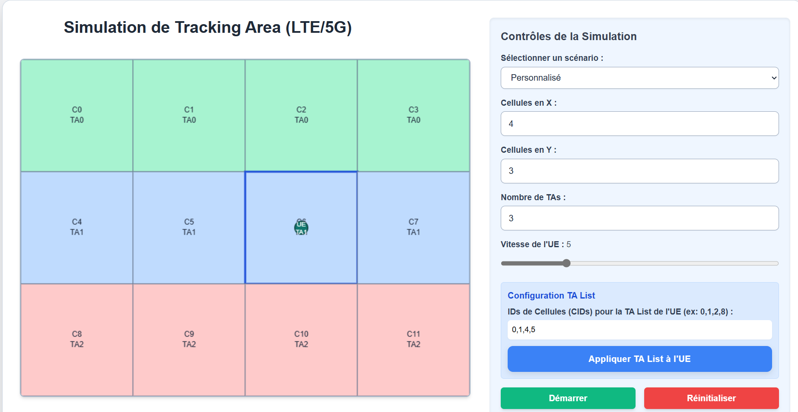

# 📶 Simulation de Tracking Area (LTE/5G)

**Simulation interactive de la gestion de la mobilité dans les réseaux LTE/5G**, mettant en avant le fonctionnement des Tracking Areas (TAs), des Tracking Area Updates (TAUs) et des TA Lists.

---

## 🚀 Fonctionnalités

### 🔷 Modélisation des Cellules et des TAs
- Visualisation d'une **grille de cellules** (eNodeB/gNodeB) regroupées en **Tracking Areas**.
- Chaque TA est colorée distinctement et organisée en **bandes horizontales** contiguës.

### 📱 Simulation d'Équipement Utilisateur (UE)
- Un UE se déplace de façon aléatoire, **simulant la mobilité d’un abonné**.

### 📡 Déclenchement d'Événements de Mobilité
- **Handover** : changement de cellule **dans la même TA**.
- **Changement de TA dans la TA List** : détecte les passages vers une TA **présente dans la liste** (pas de TAU déclenché).
- **Tracking Area Update (TAU)** : déclenché quand l’UE entre dans une **TA hors de sa TA List**.

### 👁️‍🗨️ Visualisation de la Signalisation
- Apparition de **balises visuelles temporaires** (cercles colorés + messages) indiquant :
  - Handover
  - Changement dans la TA List
  - TAU

### 🎛️ Interface Utilisateur Intuitive
- Contrôle du nombre de cellules (X/Y), du nombre de TAs, et de la vitesse de l’UE.
- **Scénarios prédéfinis** :
  - *Zone urbaine dense*
  - *Zone rurale étendue*
  - *Mode personnalisé* (configuration libre)
- Configuration manuelle de la **TA List** via des IDs de cellules (CIDs).
- **Journal d’événements** en temps réel (type, horodatage).

---

## 🛠️ Technologies Utilisées

- **HTML5** : Structure de l’application.
- **CSS3 (avec Tailwind CSS)** : Interface moderne et responsive.
- **JavaScript (Canvas API)** : Simulation, affichage graphique et logique de mobilité.

---

## 💡 Comment Utiliser

### ▶️ Lancer l’application
1. Ouvrir `index.html` dans un navigateur moderne.

### 🧪 Tester des scénarios
- Choisir un scénario prédéfini ou le mode *Personnalisé*.

### ⚙️ Configurer la Grille
- Définir les dimensions de la grille (X / Y).
- Spécifier le nombre de Tracking Areas.

### 🏃 Ajuster la Mobilité
- Contrôler la **vitesse de déplacement** de l’UE via un curseur.

### 📝 Définir la TA List
- Entrer une **liste de CIDs** (ex : `0,1,2,8`).
- Cliquer sur **"Appliquer TA List à l'UE"**.
- Le système déduira automatiquement les IDs de TAs.

### ⏯️ Contrôler la Simulation
- `Démarrer` / `Arrêter` pour contrôler la simulation.
- `Réinitialiser` pour repartir à zéro.

### 📋 Consulter le Journal
- Suivez tous les événements de mobilité avec **horodatage et type** :
  - Handover
  - Changement de TA dans la liste
  - TAU

---

## 🔮 Améliorations Futures Possibles

- 🎯 **Contrôle manuel du parcours** de l’UE.
- 👥 **Support multi-UEs** avec TA Lists personnalisées.
- 📊 **Statistiques de mobilité** (Handover/TAU par scénario).
- 🧱 **Visualisation 3D** avec Three.js.
- 💾 **Sauvegarde et chargement** de configurations.

---

## 📄 Licence

Ce projet est distribué sous licence **MIT**.  
Consultez le fichier `LICENSE` pour plus d’informations.

---
